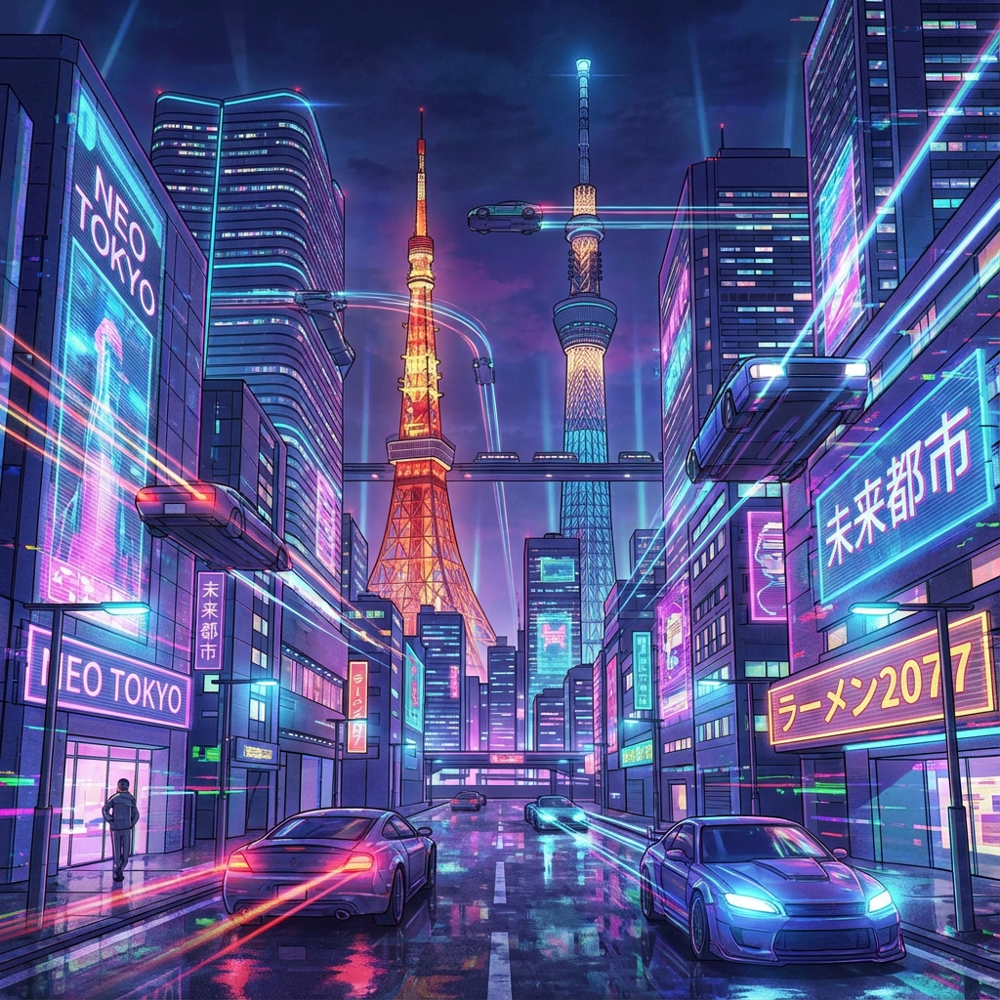

# Deck + Gemini 画像生成統合

`deck` (Go製のスライド作成ツール) と Google Gemini (Imagen) を統合し、Markdownのコードブロックから自動的に画像を生成してスライドに挿入するプロジェクトです。

## 前提条件

1.  **Deck**: `k1LoW/deck` がインストールされていること。
2.  **Laminate**: `Songmu/laminate` がインストールされていること。
3.  **uv**: Pythonパッケージマネージャー `uv` がインストールされていること。
4.  **Google Cloud Project**: Gemini API が有効化されているプロジェクトと、APIキーが必要です。

## セットアップ

1.  **依存関係のインストール**:
    プロジェクトのルートディレクトリで以下を実行し、Python環境をセットアップします。
    ```bash
    uv sync
    ```

2.  **APIキーの設定**:
    Gemini APIキーを環境変数に設定します。
    ```bash
    export GEMINI_API_KEY="あなたのAPIキー"
    ```

## 使い方

1.  **Markdownの作成**:
    `sample_presentation.md` のように、`ai-image` 言語のコードブロックを含むMarkdownを作成します。

    ````markdown
    # 今日の天気

    ```ai-image
    晴れた空と輝く太陽、アニメ風イラスト
    ```
    ````

2.  **画像生成 (Laminate)**:
    `laminate` を実行して、コードブロック内のプロンプトから画像を生成します。
    ```bash
    laminate apply --config laminate.yaml sample_presentation.md
    ```

3.  **スライド変換 (Deck)**:
    `deck` を実行して、画像を埋め込んだスライドを生成します。
    ```bash
    deck sample_presentation.md
    ```

## 設定

-   **`laminate.yaml`**: 画像生成コマンドの設定。
-   **`scripts/generate_image.py`**: 画像生成ロジック。モデル名（デフォルト: `imagen-3.0-generate-001`）やアスペクト比を変更できます。

## 代替ワークフロー: Antigravityとの対話的生成

Pythonスクリプトによる自動化の代わりに、AIエージェント「Antigravity」に直接対話で画像を生成してもらうことも可能です。

1.  **チャットで依頼**: エージェントに「〇〇の画像を生成して」と依頼します。
2.  **画像の保存**: 生成された画像が良ければ、「それを assets フォルダに保存して」と依頼します。
3.  **スライドへの配置**: Markdownファイル内で通常の画像として参照します。
    ```markdown
    
    ```

スクリプトのセットアップやGemini APIキーの管理が不要なため、手軽に試したい場合に適しています。
