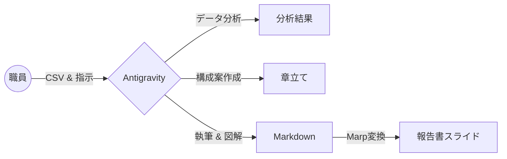
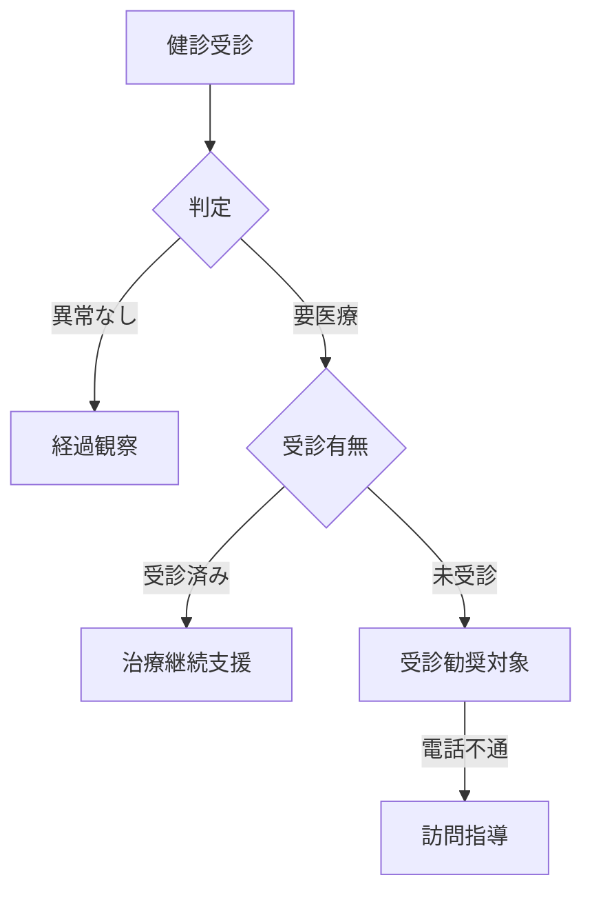

<!-- _class: lead -->

# 自治体DX: 資料作成の「自動化」革命

## Google Antigravityが変える
## 保健師・事務職員の働き方

**〜 10時間の残業が15分になった話 〜**

---

# 1. 現場の悲鳴 (Before)

「特定健診報告書」の作成シーズン、庁内は戦場でした。

*   **Excelの海:** レセプトデータと健診データを目視で突合
*   **コピペ地獄:** 集計結果をWordに貼り付け、さらにパワポへ
*   **終わらない修正:** 「ここの数字、去年のと比較して」と言われて再集計...

> **結果:**
> 本来の業務である「市民への保健指導」に手が回らない。

---

# 2. 救世主 "Antigravity" の導入

私たちは、**AIエージェント「Antigravity」** をチームに迎え入れました。
彼（AI）への指示は、チャットで話しかけるだけです。

## [実際の指示画面]
> **私:** 「今年の特定健診データ(CSV)を読み込んで。昨年と比較して、糖尿病リスク者（HbA1c 6.5以上）がどう変化したか分析して。」
>
> **Antigravity:** 「読み込みました。リスク者は昨対比110%で増加傾向です。特に40代男性の未受診が目立ちます。詳細なグラフを作成しましょうか？」

---

# 3. 自動化プロセス (The Workflow)

Antigravityは、分析から資料化までを一気通貫で行います。

職員がやることは、**「データの提供」** と **「完成品のチェック」** だけ。

---

# 4. 驚きの機能：Mermaidによる可視化

「対象者の振り分けフロー図を作って」と頼むと...
Antigravityは**一瞬で**以下の図を描き出しました。

パワポで四角形を並べていた時間は、もう不要です。

---

# 5. 劇的な成果 (After)

導入から1ヶ月。私たちの業務は一変しました。

| 業務フロー | 従来 (手作業) | **Antigravity** |
| :--- | :--- | :--- |
| **データ集計** | 3日 (Excel) | **3分** (Python実行) |
| **スライド作成** | 1日 (パワポ) | **10分** (Marp変換) |
| **残業時間** | 月40時間 | **ほぼゼロ** |

---

# 6. 生まれた時間で、何をするか

資料作成の時間がなくなった分、私たちは現場へ出ます。

*   **ハイリスク者への訪問指導** を2倍に増強
*   **市民向け健康教室** の企画・開催
*   一人ひとりの市民と向き合う、**「本来の保健師業務」**へ

> **Conclusion:**
> Antigravityは、単なる効率化ツールではありません。
> 私たちが「公務員としての使命」を果たすためのパートナーです。

---

<!-- _class: lead -->

# さあ、あなたの自治体でも
# 始めませんか？

---

# Appendix: 今回使用したプロンプト

1.  `@files 健診データ.csv を読み込み、要医療者の属性を分析して`
2.  `分析結果を元に、市長報告用のスライド構成を考えて`
3.  `Marp形式のMarkdownでスライドを出力して。グラフの代わりにMermaidを使ってフロー等の図解を入れて`
