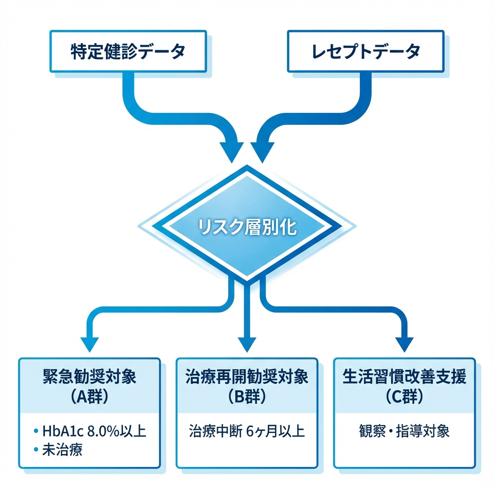
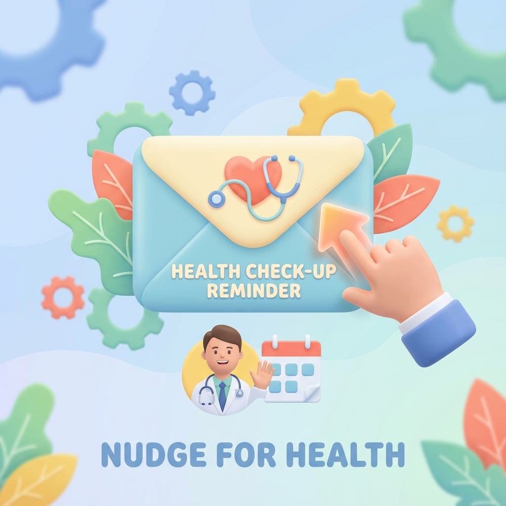

<!-- _class: lead -->

# 特定健診・糖尿病性腎症重症化予防
# 事業実施報告書

### 〜要医療者・治療中断者への介入と成果〜

**〇〇市 健康福祉部 国保年金課**
202X年X月X日

---

# 1. 事業の背景と目的

本市における透析患者数は年々増加傾向にあり、医療費の適正化が急務となっています。

*   **現状の課題:**
    *   要医療者の受診未済率が高い
    *   糖尿病治療中断者の重症化リスク
*   **目的:**
    *   データ活用によるハイリスク者の抽出
    *   早期治療導入と継続支援の強化

---

# 2. 対象者の抽出スキーム

KDBシステムを活用し、優先度の高い対象者を論理的に抽出しました。

*   **A群 (緊急):**
    HbA1c 8.0以上 + 未治療
*   **B群 (再開):**
    治療中断 6ヶ月以上

AI予測モデルによる更なる精度向上も計画中です。

---

# 3. 実施した介入施策

対象者の心理的ハードルを考慮した重層的なアプローチ。

*   **ナッジ理論の応用:**
    開封率を高め、行動変容を促すデザイン。
*   **医療連携の強化:**
    地域医師会と連携した受診しやすい環境整備。

---

# 4. 事業成果 (定量的評価)

介入の結果、顕著な受診行動の変容が確認されました。

| 対象区分 | 受診確認数 | 受診率 | 前年比 |
| :--- | :---: | :---: | :---: |
| 緊急勧奨 (A群) | 98名 | **65.3%** | +12.0pt |
| 治療再開 (B群) | 115名 | **35.9%** | +5.4pt |
| **全体** | **213名** | **45.3%** | **+8.2pt** |

> **Before/After:**
> 特に、保健師による個別勧奨を強化したA群において、高い成果が得られました。

---

# 5. 重症化予防効果の試算

本事業による医療費適正化の推計効果です。

*   **透析移行予防数:**
    推計 **2.5人** / 年
*   **医療費抑制効果:**
    **約 1,250 万円 / 年**
    (1人あたり約500万円として試算)

---

# 6. 今後の課題と展望

## 次年度の方針 (DX推進)
1. **SMS勧奨の導入:** 到達率向上
2. **AIコールの活用:** 業務効率化
3. **オンライン指導:** フォローアップ拡充

## 課題
*   若年層へのリーチ手法の確立
*   保健師の業務負荷分散

---

<!-- _class: lead -->

# ご清聴ありがとうございました

**健康福祉部 保健予防課**
(内線: XXXX)
