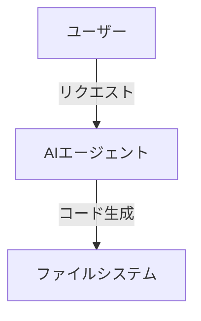

<!-- _class: lead -->

# AIエージェント時代の
# 「爆速」提案書作成術

## Google Antigravity x Marp

202X年X月X日

---

# 1. 提案書作成の「あるある」課題

素晴らしいアイデアがあっても、**「資料作成」**に時間を奪われていませんか？

*   **リサーチ地獄:** 必要な情報が集まらない、整理できない
*   **デザイン迷子:** パワポのレイアウト調整に数時間...
*   **構成のブレ:** 書いている途中で論理が破綻する

> **Solution:**
> 「思考」はAIと人間で。「体裁」はツールで自動化する。

---

# 2. 提案する新ワークフロー

**Google Antigravity (AI)** と **Marp (変換ツール)** を組み合わせることで、
プロセスを劇的に短縮します。

```mermaid
graph LR
    A[Human] -->|指示/Conversation| B(Google Antigravity)
    B -->|Web検索 & 執筆| C[Markdown Document]
    C -->|Marpで変換| D[PowerPoint (.pptx)]
    D -->|仕上げ| E[Presentation]
```

1.  **Antigravity:** リサーチ、構成案、ライティングを担当
2.  **Markdown:** コンテンツそのものに集中するフォーマット
3.  **Marp:** 一瞬でスライドデザインに変換

---

# 3. Step 1: リサーチ & 構成 (AI)

AIエージェントに「コンテキスト」を与え、調査を代行させます。

*   **プロンプト例:**
    *   「〇〇業界の2025年の課題を3つ挙げて」
    *   「競合A社のサービスの特徴を表にまとめて」
    *   **「これらを元に、クライアントB社向けの提案書の目次案を作って」**

-> **結果:** 構造化された「骨子」が数分で完成します。

---

# 4. Step 2: 執筆 & 図解 (AI)

Markdown形式で各スライドの中身を埋めていきます。
図解も **Mermaid記法** で指示すれば自動生成されます。


*(↑ この図もAIがテキストだけで描画しました)*

---

# 5. Step 3: スライド変換 (Marp)

仕上げは VS Code の拡張機能 **"Marp"** を使うだけ。

1.  Markdownファイルを開く
2.  プレビューで確認
3.  **`Export Slide Deck`** で `.pptx` を書き出し

**「パワポ職人」の作業はもう不要です。**
中身（コンテンツ）のブラッシュアップに全力を注げます。

---

# まとめ：なぜこの手法なのか

| 比較項目 | 従来の手法 | **Antigravity x Marp** |
| :--- | :--- | :--- |
| **作業比重** | デザイン 7割 / 思考 3割 | **思考 9割** / デザイン 1割 |
| **修正容易性** | レイアウト崩れとの戦い | **テキスト修正のみ**で完了 |
| **再利用性** | コピペが面倒 | **Git管理**や流用が容易 |

**"Documentation as Code"** の思想で、
提案活動の生産性を最大化しましょう。

---

<!-- _class: lead -->

# Let's Build with
# Google Antigravity

---

# Appendix: 必要な環境

*   **Editor:** Visual Studio Code
*   **AI:** Google Antigravity
*   **Extension:** Marp for VS Code

*(このスライド自体も、上記フローで作成されました)*
