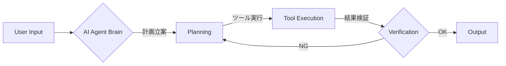

<!-- _class: lead -->

# AI Agent Business Trends 2025
## 〜自律型AIが切り拓くビジネスの新地平〜

**Google Antigravity Research Team**
202X年X月X日

---

# Executive Summary

2025年、AIエージェント市場は爆発的な成長を遂げ、企業の**「自律的オペレーション」**を実現するパートナーへと進化します。

*   **市場規模:** 2023年の37億ドルから、2025年には**約1,200億ドル**規模へ急拡大
*   **技術進化:** 「提案型」から「実行型」へ。意思決定を伴う完全自律化が進む
*   **ビジネスインパクト:** コスト削減だけでなく、人間との協働による付加価値創出が焦点に

---

# 1. 市場概況と投資トレンド

AIエージェント領域への投資は加速しており、企業インフラとしての地位を確立しつつあります。

*   **SaaS導入:** 全企業の**85%**が何らかの形でAIエージェントを利用開始
*   **VC投資:** 関連スタートアップへの投資額は**890億ドル**に到達見込み
*   **成長要因:** 
    *   大規模言語モデル (LLM) の推論コスト低下
    *   エンタープライズ向けセキュリティ基盤の整備

---

# 2. 進化する機能：自律性とマルチモーダル

従来のチャットボットとは一線を画す、高度な能力が標準化されます。

*   **自律的計画:** 複雑なゴールに対し、自ら手順を分解・実行
*   **マルチモーダル:** テキストだけでなく、音声・画像・センサーデータの統合処理

---

# 3. 産業別ユースケース

各業界で劇的な効率化と変革が進行中です。

| 業界 | 主なユースケース | 期待効果 |
| :--- | :--- | :--- |
| **CS/サポート** | 完全自律型対応、返品処理 | 対応件数の**80%**を無人化 |
| **マーケティング** | トレンド分析、キャンペーン自動生成 | リード獲得単価の削減 |
| **物流・SCM** | 需要予測、ルート最適化 | 在庫ロスの最小化 |
| **製造** | 予知保全、品質管理 | ダウンタイムの回避 |

---

# 4. 人間とAIの新しい協働関係

AIは「代替」ではなく「拡張」のフェーズへ移行します。

*   **Systems of Action:**
    単なる記録システム (Record) から、行動するシステム (Action) への進化
*   **戦略業務へのシフト:**
    定型業務をAIに任せ、人間はクリエイティブ・戦略策定に集中
*   **満足度向上:**
    煩雑な事務作業からの解放による、従業員エンゲージメントの向上

---

# 5. 導入に向けたロードマップ

2025年、企業が取るべきアクションプランです。

1.  **Phase 1: 特定領域でのPoC**
    *   社内ヘルプデスクやデータ入力など、リスクの低い業務から開始
2.  **Phase 2: "Job"の再定義**
    *   AIエージェントを「チームの一員」と見なし、業務フローを再設計
3.  **Phase 3: ガバナンス構築**
    *   AIの判断プロセスを監視・監査する体制の整備

---

<!-- _class: lead -->

# Conclusion

**"The Future is Agentic"**

AIエージェントの活用は、もはや競争優位性の源泉ではなく、
**企業の生存条件**となりつつあります。

今すぐ、最初の一歩を踏み出しましょう。

---

# (Appendix) データソース

*   Global AI Agent Market Report 2024-2025
*   Enterprise Tech Adoption Survey 2025
*   Future of Work Institute Research
