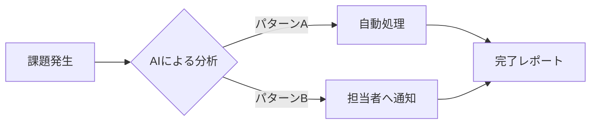

<!-- _class: lead -->

# [提案書タイトル]
## 〜サブタイトル：[主要なメリット]〜

**[あなたの名前/組織名]**
202X年X月X日

---

# アジェンダ

1.  背景と課題
2.  提案のコンセプト
3.  解決策 (Solution)
4.  スケジュール
5.  体制と費用

---

# 1. 背景と課題

現状の業務において、以下の非効率性が確認されています。

*   **課題A: 手作業によるミス**
    *   月間約XX時間のロスが発生
    *   データの整合性が取れないリスク
*   **課題B: 属人化**
    *   担当者不在時に業務が停止する
*   **課題C: スピード感の欠如**

---

# 2. 提案のコンセプト

**「自動化」と「標準化」による業務変革**

> 私たちのゴールは、単なるツールの導入ではなく、
> クライアント様の[ビジネスゴール]を達成することです。

---

# 3. 解決策 (Mermaid図解)

新しいワークフローのイメージ図です。

*   **AI分析:** 全自動で振り分け
*   **通知:** 必要な場合のみ人間が介入

---

# 4. スケジュール

3ヶ月での立ち上げを計画しています。

| フェーズ | 期間 | 内容 |
| :--- | :--- | :--- |
| **要件定義** | 2週間 | ヒアリング、仕様決定 |
| **開発** | 1ヶ月 | プロトタイプ作成、実装 |
| **検証** | 2週間 | テスト、修正 |
| **リリース** | 1週間 | 本番移行 |

---

# 5. 体制と費用

## 体制
*   PM: 1名
*   エンジニア: 2名

## 概算費用
*   **初期費用:** ¥X,XXX,XXX
*   **月額費用:** ¥XX,XXX

---

<!-- _class: lead -->

# ご検討のほど
# よろしくお願いいたします

---

<!-- 
_header: ''
_footer: '' 
-->

# (Appendix) 参考資料

*   関連データA
*   関連データB
